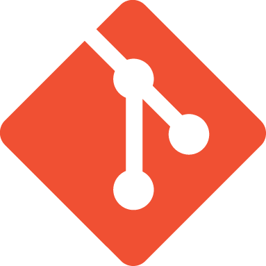
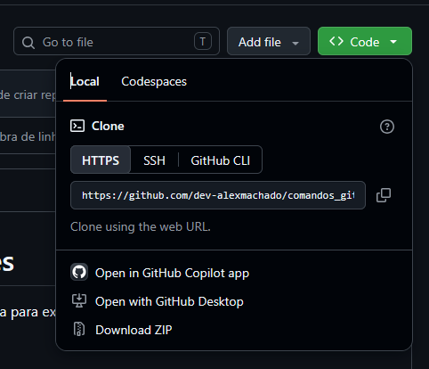

# Comandos Git para iniciantes

    

Segue abaixo a lista de comandos git e a ordem necessária para executar determinadas ações.

## Sumário

1. [Novo repositório local](#novo-repositório-local) 
1.1 [Caso as credenciais setadas do usuário sejam diferentes do desenvolvedor](#caso-as-credenciais-setadas-do-usuário-sejam-diferentes-do-desenvolvedor) 
1.2 [Caso as credenciais não estejam setadas](#caso-as-credenciais-não-estejam-setadas) 
1.3 [Quando as credenciais estiverem setadas](#quando-as-credenciais-estiverem-setadas) 
2. [Passando o repositório local para o remoto (GitHub)](#passando-o-repositório-local-para-o-remoto-github)
3. [Como atualizar o repositório remoto](#como-atualizar-o-repositório-remoto)
4. [Como mudar repositório local de máquina](#como-mudar-repositório-local-de-máquina)
5. [Como atualizar um repositório já existente com a versão remota](#como-atualizar-um-repositório-já-existente-com-a-versão-remota)
6. [Como desfazer o `git add`](#como-desfazer-o-git-add)
7. [Como desfazer um *commit*](#como-desfazer-um-commit)
8. [Como desfazer um *push*](#como-desfazer-um-push)

## Novo repositório local

Para criar novo repositório local:
~~~
git init
~~~

> [!CAUTION]
> O comando `git init`só é executado na primeira vez em que você cria um novo repositório, e só deve ser repetido  quando houver um novo repositório para ser criado. Jamais execute esse comando em um repositório caso você já tenha executado o *push* alguma vez nesse mesmo repositório.

Para listar as configurações ativas do Git:
~~~
git config --list
~~~

Pode ser usado para verificar as credenciais (user name e e-mail) usadas no repositório ou na máquina, por exemplo. As configurações podem vir em 3 níveis diferentes:
- **local**: vale só para um repositório específico
- **global**: vale para o usuário do computador
- **system**: vale para todos os usuários do sistema

### Caso as credenciais setadas do usuário sejam diferentes do desenvolvedor

#### Se as credenciais forem apenas no repositório

Para retirar as credenciais do nome de usuário do repositório:
~~~
git config --unset user.name
~~~

Para retirar as credenciais do e-mail do usuário do repositório:
~~~
git config --unset user.email
~~~

#### Se as credenciais forem globais

Para retirar as credenciais do nome de usuário de todos os repositórios:
~~~
git config --global --unset user.name
~~~

Para retirar as credenciais do e-mail do usuário de todos os repositórios:
~~~
git config --global --unset user.email
~~~

### Caso as credenciais não estejam setadas

Para setar o nome do usuário no repositório:
~~~
git config user.name "Nome do Usuário"
~~~

Ou para setar o nome do usuário em todos os repositórios:
~~~
git config --global user.name "Nome do Usuário"
~~~

Para setar o e-mail do usuário no repositório:
~~~
git config user.email "email@servidor.com"
~~~

Ou para setar o e-mail do usuário em todos os repositórios:
~~~
git config --global user.email "email@servidor.com"
~~~

### Quando as credenciais estiverem setadas

Uma nova versão do seu projeto é chamado de ***commit***. Mas para fazer o *commit* do seu projeto, antes é necessário salvar o seu trabalho no que chamamos de ***stage***, que é um passo antes do *commit*.

Para verificar quais pastas e arquivos estão prontos para ir para o *staging*:
~~~
git status
~~~

Neste momento, o terminal irá listas as pastas e arquivos na cor vermelha. Isso indica que essas pastas e arquivos estão prontas para irem para o *staging*.

Para enviar para o *stage* o arquivo que deseja fazer o *commit*:
~~~
git add <nome-do-arquivo>
~~~

Ou para enviar todos os arquivos alterados para o *stage*:
~~~
git add .
~~~

Após executar um `git add`, execute novamente o comando `git status` para verificar se as pastas e arquivos que antes estavam em vermelho agora estão em verde. Se isso acontecer, significa que eles estão prontos para irem para o *commit*. Caso ainda apareça alguma pasta ou arquivo na cor vermelha, significa que este arquivo ou pasta em específico não está no *staging*, e portanto ficará de fora do *commit*.

Para criar um novo *commit* no repositório local, ou seja, uma nova versão do seu projeto, e um ponto seguro de onde você pode prosseguir com o seu projeto:
~~~
git commit -m "Mensagem do commit"
~~~

Você poderá verificar o histórico de *commits* do seu projeto com o seguinte comando:
~~~
git log
~~~

> [!TIP]
> Para facilitar, caso tenha dúvidas sobre qual ordem executar os comandos, faça a seguinte ordem:
~~~
git init
git config --global --unset user.name
git config --global --unset user.email
git config user.name "Seu Nome de Usuário do GitHub"
git config user.email "seu_email_do_github@servidor.com"
git add .
git commit -m "Mensagem do seu commit"
~~~

## Passando o repositório local para o remoto (GitHub)

> [!IMPORTANT]
> A partir desse ponto, há a necessidade de uma conta no **GitHub**, e de um repositório criado lá, pois a seguir iremos vincular o repositório local ao repositório remoto do GitHub.

- Crie uma conta no **GitHub**, caso já não tenha.
- Crie um repositório novo no **GitHub** (botão verde ***New*** no canto superior da tela).

> [!WARNING]
> Ao criar um repositório no GitHub, você pode definir como ***public*** ou ***private***. Se quiser criar um repositório para fins de portifólio, defina-o o como ***public***. Caso estej desenvolvendo um projeto comercial, defina-o como ***private***.

Após criar o repositório remoto no GitHub, volte para o repositório local e execute os comandos a seguir no terminal do diretório do repositório.

Para vincular o seu repositório local ao repositório remoto:
~~~
git remote add origin <endereco-do-repositorio-remoto>
~~~

Para criar uma branch principal ao seu repositório para o envio ao GitHub:
~~~
git branch -M main
~~~

Para efetuar o ***push***, ou seja, envia seu repositório local para a *branch* principal do seu repositório remoto:
~~~
git push -u origin main
~~~

Após isso, o seu repositório está atualizado e ***commitado***.

> [!NOTE]
> Este procedimento visa evitar que você perca seu projeto por qualquer motivo, seja porque a máquina foi formatada, seja porque você fez alterações no seu código-fonte que não devia, seja porque alguém apagou o seu projeto da máquina. Caso isso aconteça, é possível retornar seu projeto para o último estado em que se encontrava quando foi feito o último *commit*.

> [!IMPORTANT]
> Este procedimento serve para criar o repositório local e remoto, e deve ser feito somente da primeira vez. Caso queira atualizar um repositório já existente, o procedimento é outro. Continue com a leitura para saber como atualizar tanto o repositório local quanto o remoto.

## Como atualizar o repositório remoto

> [!NOTE]
> Este procedimento deve ser executado toda vez que o usuário realizar alguma alteração no seu projeto, desde que deseje que tal alteração permaneça no seu projeto.

> [!WARNING]
> Ao retornar para um repositório em que o *push* já foi feito anteriorente, existe a possibilidade dele ter sido modificado em outra máquina ou mesmo diretamente no repositório remoto. Caso isso tenha acontecido, vão existir duas versões diferentes do mesmo repositório, o que pode ocasionar em conflitos na hora de efetuar o *push*.
> Para evitar isso, é interessante executar o comando `git pull` antes de qualquer alteração no repositório local. Isso fará com que o repositório local seja atualizado com a versão do repositório remoto, e evitará este problema.

Após enviar o seu repositório local para o repositório remoto, obviamente você retornará mais cedo ou mais tarde para o seu projeto, a fim de dar manutenção ou de corrigir possíveis erros encontrados após o *push*, ou até mesmo após a implementação da sua aplicação. Ao alterar qualquer coisa do seu projeto, seja no código-fonte, imagens estáticas ou mesmo na estrutura de pastas, o seu projeto terá atualizações não incluídas na versão que foi *commitada*.

Isso significa que, ao terminar as novas alterações, você deverá *commitar* novamente o seu projeto, a fim de criar uma nova versão dele. O procedimento para fazer isso não necessariamente será identico ao da primeira vez, já que desta vez você não precisará inicializar um repositório local, já que ele já existe, nem precisará vinculá-lo ao GitHub: ele já está vinculado. As únicas coisas que precisará fazer é adicionar as alterações ao *stage*, *commitar* e fazer o *push*, que é o reenvio do seu repositório local ao remoto, atualizando a versão que está no GitHub com a versão que está no seu computador.

Para fazer isso, execute no terminal os comandos a seguir:

Para adicionar novo arquivo ao *stage:
~~~
git add <nome-do-novo-arquivo>
~~~

Ou para adicionar o arquivo modificado ao *stage*:
~~~
git add <nome-do-arquivo-alterado>
~~~

Ou para adicionar todos os arquivos novos e alterados ao *stage*:
~~~
git add .
~~~

Para *commitar*, ou seja, cria uma nova versão do projeto, diferente da versão anterior:
~~~
git commit -m "Mensagem do commit."
~~~

Para enviar a nova versão do projeto para o GitHub:
~~~
git push
~~~

> [!TIP]
> Caso tenha dúvidas, se tiver seguido o passo a passo para o primeiro *commit*, e/ou se tiver as credenciais já setadas, pode simplesmente executar os comandos a seguir na seguinte ordem:
~~~
git add .
git commit -m "Mensagem do commit."
git push
~~~

## Como mudar repositório local de máquina

Caso esteja trabalhando em um projeto, e por algum motivo, queira trabalhar no mesmo projeto em outra máquina, é necessário clonar o seu repositório para esta nova máquina, desde que ela tenha o programa Git instalado.

- Acesse o GitHub, e dentro do repositório, clique no botão verde **Code** no canto direito da tela da página do repositório
- Copie a URL do endereço do repositório que se encontra nesse botão
- Veja na imagem abaixo

- Volte ao diretório do seu repositório local e execute o comando a seguir para baixar o repositório remoto para a máquina que não possui uma versão desse repositório:
~~~
git clone <endereco-do-repositorio-remoto>
~~~

> [!NOTE]
> Este procedimento fará com que um repositório que antes estava em outra máquina agora passe para sua nova máquina, mas isso deve ser feito somente caso esta nova máquina não tenha uma versão anterior desse mesmo repositório. Caso o PC em questão já tenha uma versão anterior deste repositório, o procedimento a ser feito é outro, que veremos a seguir.

## Como atualizar um repositório já existente com a versão remota

Caso a máquina que você esteja mexendo já tenha uma versão anterior do repositório, então o procedimento a ser feito não é um clone, mas sim um ***pull***, que atualiza o repositório local com a versão do repositório remoto. Basta executar o comando a seguir:

Para atualizar o repositório local com a versão mais recente do repositório remoto:
~~~
git pull
~~~

> [!IMPORTANT]
> Ao retornar para um repositório já existente, é uma boa prática começar executando `git pull` antes de começar a trabalhar, para não esquecer e acabar gerando duas versões atualizadas diferentes do mesmo repositório, o que pode ocasionar conflitos entre as versões, e consequentemente a perda de progresso do seu projeto.

## Como desfazer o `git add`

Às vezes, pode acontecer de você executar um `git add .`, por exemplo, mas se arrepdender antes de fazer um `git commit`. Nesse caso, o que você deseja fazer é retornar para o estado do *commit* anterior, ou seja, desfazer o `git add`. Vamos aprender como fazer isso.

Para retirar um arquivo específico do *stage*, e mantém o restante para o *commit*:
~~~
git restore --staged <arquivo>
~~~

Para retirar todos os arquivos do *stage*:
~~~
git restore --staged .
~~~

> [!IMPORTANT]
> Os comandos acima retiram os arquivos do *stage*, mas mantém as alterações feitas até logo antes da execução do `git add`. Caso queira desfazer também as mudanças feitas no arquivo, faça os comandos a seguir:

Para retirar um arquivo específico do *stage* e elimina as mudanças feitas no arquivo:
~~~
git restore <arquivo>
~~~

Para retirar todos os arquivos modificados do *stage* e elimina todas as mudanças feitas no repositório:
~~~
git restore .
~~~

## Como desfazer um *commit*

Pode acontecer, também, de você já ter feito um *commit*, mas ainda não atualizou o repositório remoto. Há três opções. Veja a seguir como desfazê-lo:
Para remover o *commit*, mas mantém as mudanças prontas para serem recommitadas, mantendo o *stage*:
~~~
git reset --soft HEAD~1
~~~

Paara remover o commit e desfaz o *stage*, mas mantém as alterações no arquivo:
~~~
git reset HEAD~1
~~~

Para remover o commit e elimina todas as alterações feitas nele, ou seja, faz o projeto voltar ao mesmo estado do último *commit*:
~~~
git reset --hard HEAD~1
~~~

> [!WARNING]
> O número na frente de `HEAD~` corresponde ao número de *commits* que o usuário deseja retornar. Exemplo: caso o usuário deseja retornar ao último *commit*, o número será 1, ou seja, `git reset HEAD~1`. Já se o usuário desejar retornar dois *commits* anteriores, o número será 2, como em `git reset HEAD~2`, e assim por diante.

## Como desfazer um *push*

Agora, caso você já tenha feito o *push*, ou seja, já atualizado o repositório remoto, o procedimento é diferente.

Para desfazer o último *commit* já enviado:
~~~
git revert HEAD
~~~

Caso deseje reverter para um *commit* específico, você precisará saber o *hash* do *commits* para o qual deseja retornar. Para isso, exiba o histórico de *commits* e seus *hashs*:
~~~
git log --oneline
~~~

Depois, execute esse comando para retornar para um *commit* específico:
~~~
git revert <hash>
~~~

> [!NOTE]
> O comando `revert` na verdade cria um novo *commit* a partir de um *commit* anterior. Ou seja, ele duplica um *commit* e joga para um novo *commit*. Isso significa que, ao fazer um `revert`, você será jogado para um editor para escrever uma mensagem do *revert*, como se fosse um novo *commit*, e aí ele cria um novo *commit* a partir do *commit* desejado.